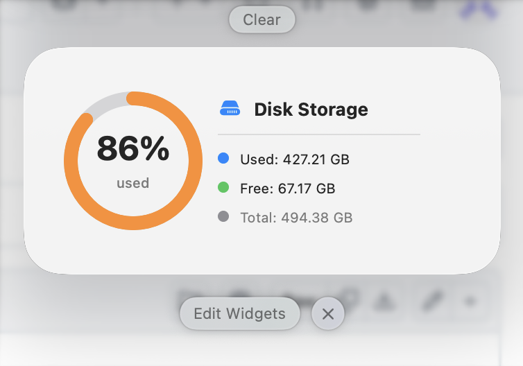

# Disk Info Widget for macOS

A macOS widget that displays disk storage information on your desktop.



## Requirements

- macOS 14.0 (Sonoma) or later
- Xcode 15.0 or later

## Build Steps

### Using Xcode

1. Clone the repository:
   ```bash
   git clone https://github.com/your-username/disk-info-widget-macos.git
   cd disk-info-widget-macos
   ```

2. Open the project in Xcode:
   ```bash
   open DiskInfoWidget.xcodeproj
   ```

3. Select the `DiskInfoWidget` scheme from the scheme selector.

4. Build and run:
   - Press `Cmd + R` to build and run, or
   - Select **Product > Run** from the menu bar.

### Using Command Line

1. Clone the repository:
   ```bash
   git clone https://github.com/your-username/disk-info-widget-macos.git
   cd disk-info-widget-macos
   ```

2. Build the project:
   ```bash
   xcodebuild -project DiskInfoWidget.xcodeproj -scheme DiskInfoWidget -configuration Release build
   ```

3. The built app will be located in the `build/Release` directory.

## Adding the Widget

1. After building and running the app, right-click on your desktop.
2. Select **Edit Widgets**.
3. Search for "Disk Info" and add the widget to your desktop.
